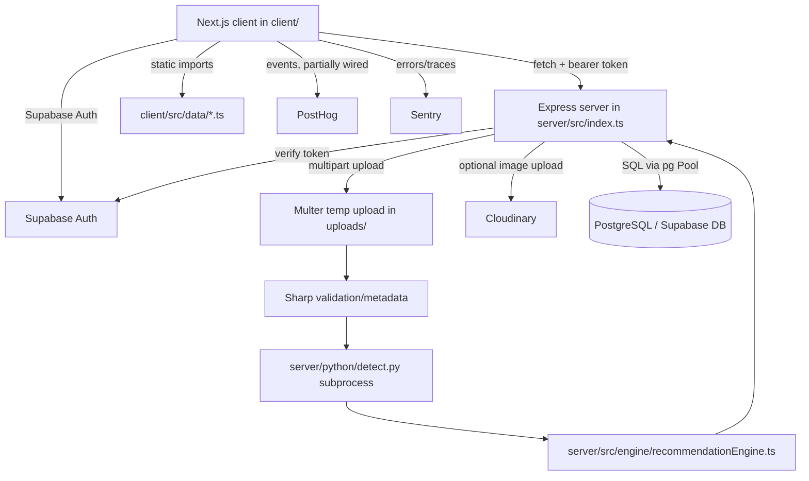
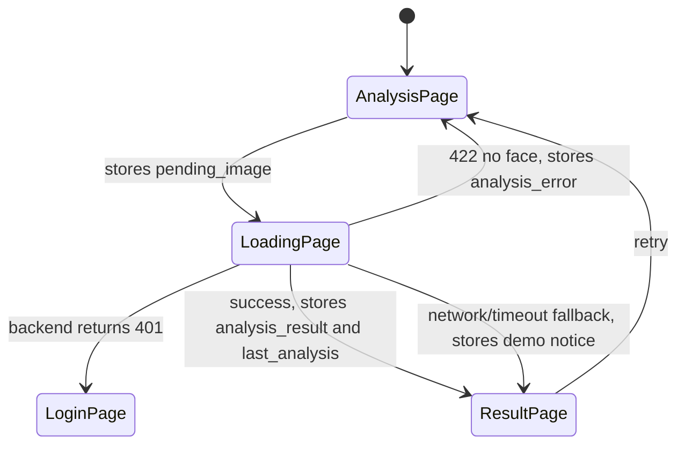
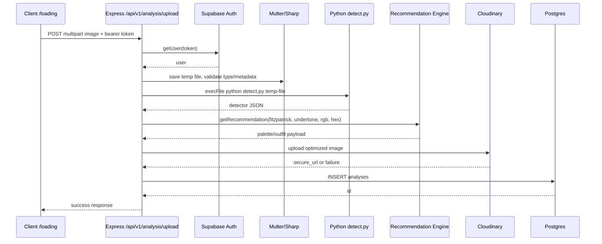

# StyleSense — Architecture

## Maintenance Note

This document is intentionally kept as a single file while it remains manageable.

If it grows beyond approximately 15,000 tokens or becomes difficult to navigate, split it into smaller focused documents while preserving all cross-references.

Do not split prematurely.

##

Generated for the working tree on 2026-06-25.

This file documents the system as it is currently implemented, not as older plans say it should be. When code and roadmap documents disagree, prefer this file and then verify the live source.

For product context, see `project.md`.
For workflow rules, see `workflow.md`.
For security policies, see `security.md`.
For verified API endpoint contracts, see `api-contracts.md`.
For project history, see `logs.md`.

## How To Use This File

- Treat sections marked **Current truth** as the active implementation.
- Treat sections marked **Risk** or **Breakage risk** as fragile contracts.
- Do not copy secrets into this file. Environment variable names are documented, values are not.

### Future Splitting Guide

If this file grows beyond ~7,000 tokens, split along these boundaries:

| Section | Target File |
|---------|-------------|
| Everything above "Generated Data And Maintenance Scripts" | `architecture.md` (core) |
| "Generated Data And Maintenance Scripts" + "Static Catalog" content | `architecture-static.md` |
| "Maintenance Playbooks" + "Deployment And Operations" + "Test Strategy" | `architecture-playbooks.md` |

Do not split now. The file is readable as-is.

## Executive Summary

StyleSense is a full-stack fashion/color-analysis application.

At runtime, the user signs in with Supabase Auth, uploads a portrait on the Next.js client, the Express server validates and analyzes the image, a Python OpenCV detector estimates skin color/undertone, an offline TypeScript recommendation engine maps Fitzpatrick type plus undertone to curated palette/outfit advice, and the server stores the analysis in PostgreSQL/Supabase-compatible tables.

There is also a static discovery/catalog experience backed by generated TypeScript data from TSV/CSV product sources. That catalog is mostly independent from the image-analysis workflow.

Important current truths:

- Frontend app lives in `client/`, not `frontend/`.
- Backend app lives in `server/`.
- Active API base is `/api/v1/analysis`.
- Upload/manual analysis endpoints require a valid Supabase bearer token.
- Current recommendations are offline rule/table driven, not live Anthropic API driven.
- Current Python detector is `server/python/detect.py`.
- Current database shape expected by code is UUID `analyses` with `result jsonb` and optional `user_id`.
- Client production build currently fails because `client/src/app/outfit/[id]/page.tsx` has invalid TSX.
- Client lint currently fails for the same parse issue plus several lint/type issues.
- Server TypeScript build passes.
- Server Jest tests report passing, but the Jest process leaks workers and did not exit cleanly in the harness.

## Current Verification Baseline

These commands were run during reverse engineering:

| Command | Result | Notes |
| --- | --- | --- |
| `npm --prefix server run build` | Pass | TypeScript server compiles. |
| `npm --prefix server test` | Tests pass, process timed out | Jest reported 2 suites and 6 tests passed, then warned about worker teardown/open handles. |
| `npm --prefix client run lint` | Fail | Hard parse error in `client/src/app/outfit/[id]/page.tsx`, plus lint errors. |
| `npm --prefix client run build` | Fail | Turbopack parse error in `client/src/app/outfit/[id]/page.tsx`. |

Current client build blocker:

```text
client/src/app/outfit/[id]/page.tsx
Expected corresponding JSX closing tag for 'Favorite'
```

Other known client issues include missing/invalid imports in the same outfit page, `any` lint violations, setState-in-effect lint rules, and unused imports.

## Product And User Workflows

### Core Image Analysis Flow

1. User signs up or logs in through Supabase Auth.
2. User visits `/analysis`.
3. User selects or drags a portrait image.
4. Client reads it as a data URL preview.
5. User clicks Analyze.
6. Client stores the data URL in `sessionStorage.pending_image`.
7. Client navigates to `/loading`.
8. `/loading` converts the data URL to a Blob and sends multipart form data to `POST /api/v1/analysis/upload`.
9. `apiFetch` attaches `Authorization: Bearer <Supabase access token>`.
10. Backend verifies the token with Supabase service role client.
11. Backend validates upload type/size with Multer and Sharp.
12. Backend runs `server/python/detect.py` as a subprocess.
13. Python returns Fitzpatrick type, undertone, RGB/hex, face detection flag, confidence, and measurement data.
14. Backend rejects the upload with 422 if no face is detected.
15. Backend maps detector output through `getRecommendation`.
16. Backend attempts Cloudinary upload. Failure is logged and does not fail the analysis response.
17. Backend attempts to save to `analyses`.
18. Backend returns `{ success: true, analysisId, data, requestId }`.
19. Client stores `data` in `sessionStorage.analysis_result` and `localStorage.last_analysis`.
20. Client navigates to `/result`.
21. `/result` renders stored data only.

### Static Outfit Discovery Flow

1. User visits `/discover`.
2. Page reads generated `OUTFITS`, `PRODUCTS`, and `OUTFIT_PRODUCTS`.
3. User filters by category, budget, brand, or search text.
4. User clicks a look.
5. Next.js route `/outfit/[id]` renders outfit details, product cards, alternatives, related looks, save/share/download actions.
6. Saved outfits are stored in browser `localStorage.savedOutfits`.

This flow does not currently depend on backend analysis results.

### History Flow

1. User visits `/history`.
2. Client `fetchAnalysisHistory()` calls `GET /api/v1/analysis/history`.
3. `apiFetch` attaches Supabase bearer token when available.
4. Backend optional auth middleware accepts missing token as guest, but returns empty list when no user exists.
5. Authenticated users get latest 10 `analyses` rows for their `user_id`, if the database has `user_id`.
6. History card links currently point to `/result?id=<analysisId>`.

Risk: `/result` currently reads browser storage and does not fetch by query parameter. Clicking a history entry will not reliably load that historical result unless `last_analysis` happens to match.

## System Architecture



## Repository Map

| Path | Role | Runtime status |
| --- | --- | --- |
| `client/` | Main Next.js App Router frontend. | Active. |
| `server/` | Main Express/TypeScript backend plus Python detector. | Active. |
| `server/python/detect.py` | Subprocess image analyzer used by backend. | Active. |
| `server/python/api.py` | FastAPI/PostHog analyzer. | Appears legacy or experimental; not wired into Express. |
| `server/sql/*.sql` | Current SQL scripts for analysis history/user_id support. | Operationally important. |
| `server/migrations/*.js` | Older node-pg-migrate migrations. | Mismatch current UUID/jsonb schema; treat carefully. |
| `client/src/data/*.ts` | Generated static catalog/outfit data. | Active for discover/outfit pages. |
| Root Python scripts | TSV/product catalog generation/cleanup. | Maintenance scripts with side effects. |
| `scripts/dev-all.cjs` | Starts server and client together with dynamic API URL. | Active dev helper. |
| `plan/` | Product/technical/design planning docs. | Historical/intended context, not runtime truth. |
| `docs/` | Progress/session notes. | Historical context. |
| `.claude/`, `.codex/`, `.agents/` | Agent instructions and local skills. | Tooling only, not app runtime. |
| Root `pages/`, root `next.config.js`, root Sentry JS files | Older Sentry/Next wizard artifacts. | Likely stale or duplicate; active app is under `client/`. |

## Frontend: `client/`

### Framework And Build

- Next.js 16.2.1 App Router.
- React 19.2.4.
- TypeScript with strict mode in `client/tsconfig.json`.
- Tailwind CSS 4 through PostCSS.
- Sentry wrapped in `client/next.config.ts`.
- `client/next.config.ts` has `typescript.ignoreBuildErrors: true`, but syntax parse errors still fail production builds.
- Dev script: `npm --prefix client run dev`.
- Build script: `npm --prefix client run build`.
- Lint script: `npm --prefix client run lint`.

### Frontend Entry Points

| File | Role |
| --- | --- |
| `client/src/app/layout.tsx` | Root HTML shell, metadata, fonts, wraps app in `Providers`. |
| `client/src/app/providers.tsx` | Wraps `AuthProvider` and `SavedOutfitsProvider`. Does not currently include `PostHogProvider`. |
| `client/src/lib/supabase.ts` | Browser Supabase client using `NEXT_PUBLIC_SUPABASE_URL` and `NEXT_PUBLIC_SUPABASE_ANON_KEY`. Throws if missing. |
| `client/src/lib/auth-context.tsx` | Global auth context driven by `supabase.auth.onAuthStateChange`. |
| `client/src/lib/api.ts` | Central fetch wrapper, API URL normalization, bearer-token attachment, response normalization. |
| `client/src/types/analysis.ts` | Client mirror of backend analysis contract. Keep in sync with `server/src/types/analysis.ts`. |

### Client Routes

| Route | File | Purpose | Auth |
| --- | --- | --- | --- |
| `/` | `client/src/app/page.tsx` | Landing/home route. | Public. |
| `/login` | `client/src/app/login/page.tsx` | Email/password and Google login. | Redirects logged-in users to `/analysis`. |
| `/signup` | `client/src/app/signup/page.tsx` | Email/password signup and Google OAuth. | Redirects logged-in users to `/analysis`. |
| `/forgot-password` | `client/src/app/forgot-password/page.tsx` | Supabase reset email. | Public. |
| `/auth-check` | `client/src/app/auth-check/page.tsx` | Auth/session check UI. | Public/diagnostic. |
| `/auth-check/callback` | `client/src/app/auth-check/callback/route.ts` | OAuth code exchange, redirects to `/analysis`. | Public callback. |
| `/analysis` | `client/src/app/analysis/page.tsx` | Image upload UI. | Wrapped in `RequireAuth`. |
| `/loading` | `client/src/app/loading/page.tsx` | Performs upload API call and fallback analysis. | Requires valid backend token indirectly; not wrapped in `RequireAuth`. |
| `/result` | `client/src/app/result/page.tsx` | Renders last stored result from browser storage. | `RequireAuth` imported but not used. |
| `/history` | `client/src/app/history/page.tsx` | Analysis history from backend. | Wrapped in `RequireAuth`. |
| `/wardrobe` | `client/src/app/wardrobe/page.tsx` | Static wardrobe/mock recommendation page. | Wrapped in `RequireAuth`. |
| `/discover` | `client/src/app/discover/page.tsx` | Static outfit catalog browser. | Public in current code. |
| `/outfit/[id]` | `client/src/app/outfit/[id]/page.tsx` | Outfit detail page. | Public in current code, currently broken TSX. |
| `/settings` | `client/src/app/settings/page.tsx` | Mostly local/mock settings, Supabase logout. | `RequireAuth` imported but not used. |

### Client Auth Model

`AuthProvider` exposes:

```ts
type AuthContextValue = {
  user: User | null;
  loading: boolean;
};
```

Important behavior:

- The provider waits for Supabase `onAuthStateChange`.
- `RequireAuth` redirects to `/login` after auth resolves with no user.
- API requests call `supabase.auth.getSession()` and attach `Authorization: Bearer <access_token>` when present.
- Login redirects to `/analysis` after success.
- Google OAuth hard-codes redirect target `https://www.stylesens.in/auth-check/callback` in login/signup pages.

Breakage risk:

- Changing Supabase env var names breaks app startup because `client/src/lib/supabase.ts` throws immediately.
- Changing auth redirect URLs requires matching Supabase provider configuration.
- Removing `AuthProvider` from `providers.tsx` breaks `RequireAuth` and `apiFetch` token retrieval assumptions.

### Browser Storage Contract

| Key | Storage | Writer | Reader | Purpose |
| --- | --- | --- | --- | --- |
| `pending_image` | `sessionStorage` | `/analysis` | `/loading` | Base64/data URL to upload. |
| `analysis_result` | `sessionStorage` | `/loading` | `/result` | Latest analysis result for immediate render. |
| `last_analysis` | `localStorage` | `/loading` | `/result` | Refresh fallback for latest result. |
| `analysis_error` | `sessionStorage` | `/loading` | `/analysis` | Face-gate or generic error after redirect. |
| `analysis_notice` | `sessionStorage` | `/loading` | `/result` | Demo/fallback notice banner. |
| `savedOutfits` | `localStorage` | `SavedOutfitsProvider` | `SavedOutfitsProvider` | Saved outfit IDs/folders. |
| `stylesense-recent-looks` | `localStorage` | `/outfit/[id]` | `/outfit/[id]` | Recently viewed outfit IDs. |
| `temporary_login` | `sessionStorage` | `/login` | Not clearly used | UI/legacy marker. |
| `remember_me` | `localStorage` | `/forgot-password` | Not clearly used | UI/legacy marker. |

Do not rename these keys without updating every route in the flow.

### Client Analysis State Flow



Current edge cases:

- `/loading` has a 40 second fetch abort and a 60 second UI safety timeout.
- Network failures, aborted requests, invalid JSON content, non-JSON responses, and many 5xx cases fall back to client-side demo analysis.
- 400 errors show an error state instead of demo fallback.
- 422 no-face errors redirect back to `/analysis`.
- 401 redirects to `/login`.

### Client API Layer

`client/src/lib/api.ts` is the only intended API entry point.

Key behavior:

- `normalizeBaseUrl()` removes trailing `/api` or `/api/vN` from `NEXT_PUBLIC_API_URL`.
- Fallback base URL is `http://localhost:4000`.
- `apiFetch(path, init)` resolves relative paths against `API_BASE_URL`.
- `getAuthHeaders()` attaches bearer token when Supabase has a session.
- `fetchAnalysisById()`, `fetchAnalysisHistory()`, and `fetchAnalysisStats()` normalize backend payloads defensively.

Breakage risk:

- Components should not bypass `apiFetch`, or auth headers and base URL normalization can be skipped.
- Backend payload shape is normalized on the client, but missing core fields still degrade result UI.
- `fetchAnalysisById()` exists, but `/result` does not currently use it for `?id=...`.

### Result Rendering

Result UI is centered around:

- `client/src/app/components/result/AnalysisResultView.tsx`
- `client/src/app/components/result/result-utils.ts`
- `client/src/app/components/result/types.ts`

Intent:

- Parse unstable backend/fallback data into a stable UI shape.
- Render palette, profile, outfits, materials/accessories, and next steps.
- Be defensive because analysis payloads may be from old DB rows, new DB rows, or client fallback.

Breakage risk:

- Keep `client/src/types/analysis.ts`, `server/src/types/analysis.ts`, and result component types in sync.
- The backend stores `result jsonb` and later parsers accept both old string arrays and new rich objects.
- Removing defensive defaults can break rendering for legacy DB rows.

### Static Catalog And Outfit UI

Active data files:

- `client/src/data/products.ts`
- `client/src/data/outfits.ts`
- `client/src/data/outfitProducts.ts`
- `client/src/utils/outfitLogic.ts`

Behavior:

- `discover/page.tsx` builds a `LOOKS` array from generated data.
- It filters locally by category, budget, brand, and search terms.
- `outfit/[id]/page.tsx` derives title, style, alternatives, tags, related looks, and recently viewed state locally.
- Product images are remote URLs. Many are from Pinterest, Myntra, Shopify, Snitch, H&M, Offduty, and other stores.

Risk:

- Generated product data contains typos and at least one blank product row.
- Remote images may break or disallow optimization/CORS.
- `outfit/[id]/page.tsx` is currently not parseable, so this route blocks client build.

### Saved Outfit State

`SavedOutfitsProvider` stores records as:

```ts
type SavedOutfitRecord = {
  id: string;
  folderId: string;
  createdAt: number;
};
```

It migrates older `string[]` saved data to object records.

Risk:

- There is no server persistence for saved outfits.
- Clearing browser storage loses saved outfits.
- PostHog capture calls are made from this context even though the global `PostHogProvider` is not mounted.

## Backend: `server/`

### Framework And Runtime

- Express 5.2.1.
- TypeScript, CommonJS output to `server/dist`.
- Port selection: `process.env.STYLESENSE_PORT || process.env.PORT || 4000`.
- Main entry: `server/src/index.ts`.
- Dev script: `npm --prefix server run dev`.
- Plain dev: `npm --prefix server run dev:plain`.
- Build: `npm --prefix server run build`.
- Test: `npm --prefix server test`.

### Middleware Order

`server/src/index.ts` applies:

1. `dotenv.config()`
2. `app.set('trust proxy', 1)`
3. `express-rate-limit` window 1 minute, max 20 requests/IP
4. `helmet()`
5. CORS allowlist:
   - `http://localhost:3000`
   - `https://www.stylesens.in`
   - `https://stylesens.in`
6. `express.json()`
7. request logger
8. rate limiter
9. `/health`
10. `/api/v1/analysis` router
11. error handler

Security note: `server/src/index.ts` logs `DATABASE_URL` to console. `server/src/utils/db.ts` also logs it. This leaks secret-bearing connection strings into logs and should be removed before production.

### Backend API Reference

For full endpoint documentation, validation rules, request/response formats, and security review, see `api-contracts.md`.

Base path: `/api/v1/analysis`

| Method | Path | Auth | Purpose |
| --- | --- | --- | --- |
| `GET` | `/health` | None | Health check (server root) |
| `POST` | `/manual` | Required | Manual skin tone/undertone analysis |
| `POST` | `/upload` | Required | Image upload and analysis |
| `GET` | `/history` | Optional | Latest 10 rows for authenticated user |
| `GET` | `/stats` | Optional | Aggregate stats for authenticated user |
| `GET` | `/result/:id` | Optional | Analysis by ID (split format) |
| `GET` | `/:id` | Optional | Analysis by ID (flat format) |

### Auth Middleware

Active file: `server/src/middleware/auth.ts`.

Behavior:

- Creates a Supabase server client with `SUPABASE_URL` and `SUPABASE_SERVICE_ROLE_KEY`.
- Disables auto-refresh and session persistence.
- Extracts `Bearer <token>` from `Authorization`.
- `authMiddleware` requires token, verifies with `supabase.auth.getUser(token)`, sets `req.user`, otherwise 401.
- `optionalAuthMiddleware` proceeds as guest if no token, but 401s invalid tokens.

Legacy duplicate:

- `server/middleware/auth.ts` is a top-level duplicate not imported by active Express server.
- Do not edit the legacy duplicate when fixing runtime auth.

Breakage risk:

- `SUPABASE_SERVICE_ROLE_KEY` must match the `SUPABASE_URL` project.
- `server/src/config/supabase.ts` decodes the service-role JWT payload and throws if the project ref conflicts with the URL.
- If auth middleware fails, `/analysis/upload` returns 401 and the client redirects to `/login`.

### Upload Analysis Workflow



Important implementation details:

- Multer writes temp files under `uploads/`.
- Upload file size limit is 5 MB.
- Accepted MIME headers: JPEG, PNG, WebP.
- Sharp validates actual image metadata.
- Python is launched with `PYTHON_BIN || "python"`.
- `PYTHON_TIMEOUT_MS` in code is a hardcoded `25_000`; the `.env.example` variable is currently not used by the route.
- Temp file is deleted in `finally`.
- Cloudinary failures are warned and skipped, not fatal.
- DB save failures are logged and do not necessarily fail the upload response.

Risk:

- The client may receive `success: true` with `analysisId: null` if DB save fails.
- Cloudinary misconfiguration does not break the response, but leaves `image_url` empty.
- Python dependency/environment issues produce 502 or 504 responses and client demo fallback may hide the server problem.

### Python Detector

Active file: `server/python/detect.py`.

Dependencies:

- OpenCV (`cv2`)
- NumPy

Algorithm summary:

1. Load image from filesystem.
2. Resize to max edge 640.
3. Apply grey-world white balance.
4. Detect largest face using OpenCV Haar cascade.
5. Sample cheek/forehead/chin regions if face is found.
6. Fall back to center crop if no usable face regions exist.
7. Mask skin-like pixels in YCrCb.
8. Compute median BGR/RGB and LAB values.
9. Compute ITA angle.
10. Map ITA to Fitzpatrick type I-VI.
11. Estimate undertone from LAB `a`/`b`.
12. Emit compact JSON on stdout.

Success output:

```json
{
  "success": true,
  "data": {
    "fitzpatrick_type": "IV",
    "fitzpatrick_desc": "...",
    "undertone": "warm",
    "rgb": [154, 121, 108],
    "hex": "#9a796c",
    "ita_angle": 10.1,
    "L_star": 55.0,
    "a_star": 4.0,
    "b_star": 12.0,
    "regions_sampled": 4,
    "face_detected": true,
    "region_delta_e": 5.5,
    "confidence": 0.9,
    "elapsed_ms": 100.0
  }
}
```

Breakage risk:

- The Express route validates exact shape with Zod. Extra fields are okay, but missing/renamed required fields fail.
- If `face_detected` is false, backend returns 422 no-face even though detector still produced fallback measurements.
- All detector errors must be emitted as JSON or Express will report invalid runtime output.

Legacy/experimental:

- `server/python/api.py` defines a FastAPI analyzer with MediaPipe and PostHog. It is not called by Express and is not part of the current upload path.

### Recommendation Engine

Active file: `server/src/engine/recommendationEngine.ts`.

Current truth:

- The engine is offline and deterministic.
- It has a large curated table keyed by `<FitzpatrickType>_<undertone>`, for example `IV_warm`.
- It returns seasonal color recommendations, best colors, colors to avoid, outfit suggestions, style rules, materials, accessories, confidence metadata, signature colors, skin description, and next steps.
- `getRecommendation()` is synchronous.
- `getRecommendationAsync()` only preserves an async signature for older callers.

Despite older docs and env examples mentioning Anthropic:

- `server/src/routes/analysis.ts` imports and uses the local `getRecommendation`.
- There is no active Anthropic API call in the inspected upload/manual route.
- `ANTHROPIC_API_KEY` is currently an unused or future/legacy env var.

Breakage risk:

- Frontend result components expect rich object arrays for `best_colors`, `avoid_colors`, and `outfits`.
- DB parsers still support legacy `string[]`, but new data should stay rich.
- Changing enum values for outfit categories or color groups requires updating client/server types together.

### Database Layer

Active DB helper: `server/src/utils/db.ts`.

Behavior:

- Uses `pg.Pool`.
- Reads `DATABASE_URL`.
- Enables SSL with `rejectUnauthorized: false`.
- Exports `query(text, params)` and `connect()`.

Security risk:

- Logs `DATABASE_URL` at module load.

### Current Schema Expected By Runtime

The active route dynamically checks the `analyses` table for optional columns:

- `result`
- `user_id`

Expected table shape from `server/sql/analysis_history_schema.sql`:

```sql
create table if not exists public.analyses (
  id uuid primary key default gen_random_uuid(),
  user_id uuid,
  skin_tone text not null,
  undertone text not null,
  result jsonb not null default '{}'::jsonb,
  image_url text,
  created_at timestamptz not null default now()
);
```

Indexes expected:

- `idx_analyses_created_at`
- `idx_analyses_skin_tone`
- `idx_analyses_undertone`
- `idx_analyses_user_id`

Compatibility table:

- `public.results` still appears in SQL for older app versions, but current upload stores full result in `analyses.result`.

Older migrations conflict:

- `server/migrations/1679981263711_create-users-table.js` creates integer-style users.
- `server/migrations/1679981273711_create-analyses-table.js` uses integer `user_id` and requires `image_url`.
- `server/migrations/1679981283711_create-results-table.js` references integer `analyses`.

Operational guidance:

- Prefer `server/sql/analysis_history_schema.sql` for the current code path.
- Do not blindly run old node-pg-migrate migrations against a Supabase UUID auth-linked database without reconciling schema.
- If history returns empty unexpectedly, first check whether `analyses.user_id` exists and whether inserted rows have the authenticated Supabase user UUID.

### Save Analysis Logic

`saveAnalysis()`:

1. Calls `analysesCaps()` to inspect columns.
2. Inserts `image_url`, `skin_tone`, `undertone`.
3. Adds `result::jsonb` if column exists.
4. Adds `user_id` if column exists and authenticated user exists.
5. Returns inserted `id`.

`analysesCaps()` caches only when both `result` and `user_id` exist. If columns are missing, it re-checks on future requests so migrations can be applied while the server is running.

Breakage risk:

- Removing `result` reduces result/history detail.
- Removing `user_id` makes authenticated history impossible.
- Changing `id` from UUID breaks route validation and client assumptions.

## Integrations

### Supabase

Used for:

- Client authentication.
- OAuth callback exchange.
- Backend bearer-token verification.
- Postgres-compatible database when `DATABASE_URL` points at Supabase.

Client env:

- `NEXT_PUBLIC_SUPABASE_URL`
- `NEXT_PUBLIC_SUPABASE_ANON_KEY`

Server env:

- `SUPABASE_URL`
- `SUPABASE_SERVICE_ROLE_KEY`
- `NEXT_PUBLIC_SUPABASE_ANON_KEY` or `NEXT_PUBLIC_SUPABASE_PUBLISHABLE_KEY` may be read by `server/src/lib/supabase.ts`, but that helper does not appear central to current runtime.

### Cloudinary

Used by `server/src/utils/cloudinary.ts`.

Env:

- `CLOUDINARY_CLOUD_NAME`
- `CLOUDINARY_API_KEY`
- `CLOUDINARY_API_SECRET`
- `CLOUDINARY_FOLDER`, default `stylesense`
- `CLOUDINARY_UPLOAD_TIMEOUT_MS`, default 30000

Behavior:

- Optimizes with Sharp: rotate, resize max 1600x1600, JPEG quality 85.
- Uploads as image resource.
- Returns `secure_url`.

Failure behavior:

- Upload route catches Cloudinary errors and proceeds without image URL.

### Sentry

Active client Sentry files:

- `client/sentry.client.config.ts`
- `client/sentry.server.config.ts`
- `client/sentry.edge.config.ts`
- `client/src/instrumentation.ts`
- `client/next.config.ts`

Status:

- Sentry DSN is hard-coded in client files.
- `withSentryConfig` wraps active client Next config.
- Root-level Sentry files and `pages/api/sentry-example-api.js` appear stale or wizard-generated.

Risk:

- Hard-coded DSN is public-ish but still environment-specific. Prefer env-driven config.
- Trace sample rate is 1.0, which can be expensive/noisy in production.

### PostHog

Files:

- `client/src/app/providers/PostHogProvider.tsx`
- Direct imports from `posthog-js` in pages/context.
- `server/python/api.py` also initializes PostHog, but it is not active in Express.

Status:

- `PostHogProvider` initializes pageview capture manually.
- `client/src/app/providers.tsx` currently does not include `PostHogProvider`.
- Some code calls `posthog.capture()` directly anyway.
- `PostHogProvider` logs PostHog key and host to console.

Risk:

- Events may work inconsistently depending on whether direct imports initialize the client.
- Avoid logging analytics keys/config in production console.

### Anthropic

Dependencies/env:

- `@anthropic-ai/sdk` exists in `server/package.json`.
- `ANTHROPIC_API_KEY` appears in `server/.env.example`.

Current truth:

- The inspected active analysis route does not call Anthropic.
- Treat Anthropic as planned/legacy unless a future change wires it back in.

## Configuration

### Root Scripts

Root `package.json`:

```json
{
  "dev": "node scripts/dev-all.cjs",
  "dev:client": "npm --prefix client run dev",
  "dev:server": "npm --prefix server run dev"
}
```

`scripts/dev-all.cjs`:

- Finds a free server port starting at `STYLESENSE_PORT` or 4000.
- Starts server with `npm run dev:plain`.
- Polls `/health`.
- Starts client with:
  - `NEXT_PUBLIC_API_URL=http://localhost:<port>/api/v1`
  - `REACT_APP_API_URL=http://localhost:<port>`
- Prefixes client/server output.
- Attempts process-tree shutdown on exit.

### Client Environment

Required:

- `NEXT_PUBLIC_SUPABASE_URL`
- `NEXT_PUBLIC_SUPABASE_ANON_KEY`

Common:

- `NEXT_PUBLIC_API_URL`
- `NEXT_PUBLIC_POSTHOG_KEY`
- `NEXT_PUBLIC_POSTHOG_HOST`

Sentry currently uses hard-coded DSN rather than env in inspected files.

### Server Environment

From `server/.env.example` and code:

- `PORT` or `STYLESENSE_PORT`
- `DATABASE_URL`
- `SUPABASE_URL`
- `SUPABASE_SERVICE_ROLE_KEY`
- `ANTHROPIC_API_KEY` (not active in current analysis path)
- `CLOUDINARY_CLOUD_NAME`
- `CLOUDINARY_API_KEY`
- `CLOUDINARY_API_SECRET`
- `CLOUDINARY_FOLDER`
- `PYTHON_BIN`
- `PYTHON_TIMEOUT_MS` (listed, but route currently hardcodes timeout)
- `DB_MAX_ATTEMPTS` and `DB_RETRY_DELAY_MS` (listed, not clearly used in inspected `db.ts`)

Do not commit real `.env` files.

## Security Posture

For full security requirements, see `security.md`.
For per-endpoint security review, see `api-contracts.md` → Security Review.

Summary of implemented security measures:

- Supabase bearer-token verification for upload/manual analysis
- Optional auth for history/stats/result fetches
- Helmet security headers on Express
- CORS allowlist
- Rate limit: 20 requests per minute per IP
- Upload MIME filtering + size limit (5 MB) + Sharp validation
- No-face gate returns 422
- Temp file cleanup
- Error handler avoids leaking internals to client

Known risks documented in `security.md` → Known Security Issues.

## Deployment And Operations

### Expected Services

- Next.js client host, likely Vercel or similar.
- Node/Express backend host, likely Railway/Render or similar.
- PostgreSQL/Supabase database.
- Supabase Auth project.
- Cloudinary account for image storage.
- Python runtime with OpenCV and NumPy available to the backend process.

### Backend Runtime Requirements

- Node compatible with dependencies.
- Python executable available as `PYTHON_BIN` or `python`.
- Python packages from `server/requirements.txt`.
- Write access to `uploads/` temp directory.
- Network access to Supabase/Postgres and Cloudinary.

### Health And Debugging

Health:

```bash
curl http://localhost:4000/health
```

Expected:

```text
Server is healthy
```

Common debugging checks:

- If upload returns 401, check Supabase session, bearer token, service role key, and project-ref mismatch.
- If upload returns 400, check MIME type, file size, Sharp metadata, and form field name `image`.
- If upload returns 422, Python did not detect a face.
- If upload returns 502, detector output was invalid or Python runtime failed.
- If upload returns 504, Python subprocess timed out.
- If response has `analysisId: null`, check database insert and schema.
- If history is empty, check `analyses.user_id`, auth token, and saved rows.
- If client cannot reach API, check `NEXT_PUBLIC_API_URL` normalization and CORS origin.

## Data Contracts

### AnalysisPayload

Canonical payload is mirrored between server and client:

- `server/src/types/analysis.ts`
- `client/src/types/analysis.ts`

Core fields:

```ts
interface AnalysisPayload {
  skin_tone: string;
  undertone: string;
  season: string;
  confidence: number;
  rgb: [number, number, number];
  hex: string;
  best_colors: ColorEntry[];
  avoid_colors: AvoidColor[];
  outfits: Outfit[];
  style_rules: string[];
  season_explanation: string;
  materials: Material[];
  accessories: Accessory[];
  confidence_reason?: ConfidenceReason;
  signature_colors?: SignatureColor[];
  skin_description?: string;
  next_steps?: string[];
}
```

Important:

- `confidence` may arrive as 0-1 or 0-100 in some sources. Parsers clamp to percentage.
- Hex values are normalized to `#RRGGBB` with defaults.
- Legacy DB rows may contain arrays of strings; parsers convert them into rich objects with defaults.

### History Item

```ts
interface AnalysisHistoryItem {
  analysisId: string;
  skin_tone: string;
  undertone: string;
  hex: string;
  created_at: string | null;
}
```

### Stats

```ts
interface AnalysisStats {
  most_common_skin_tone: string | null;
  most_common_undertone: string | null;
  total_analyses: number;
}
```

## Generated Data And Maintenance Scripts

### Static Catalog Inputs

Tracked product/source files include:

- `products.tsv`
- `user_products.tsv`
- `clean_tshirts.tsv`
- `clean_remaining.tsv`
- `clothes/produts - *.tsv`
- `clothes/produts - Outfit_Products.csv`
- `snitch.json`
- `snitch_products.json`
- `uspolo.json`
- Pinterest images under `clothes/summer casual men outfit pins/`

### Generation Scripts

| Script | Purpose | Side effects |
| --- | --- | --- |
| `build_catalog.py` | Fetches product JSON from Snitch/US Polo and writes `products.tsv`. | Network fetch, rewrites TSV. |
| `generate_products.py` | Reads absolute Windows TSV paths and writes `client/src/data/products.ts`. | Rewrites tracked TS data. |
| `generate_ts_data.py` | Builds products, outfit products, and outfits TS data from TSVs. | Rewrites `client/src/data/products.ts`, `outfitProducts.ts`, `outfits.ts`. |
| `clean_tsv.py` | Cleans one Tshirts TSV into `clean_tshirts.tsv`. | Rewrites TSV. |
| `clean_remaining.py` | Similar cleanup for remaining rows. | Rewrites TSV. |
| `paste_to_sheet.ps1` | Puts TSV content on clipboard and pastes into Google Sheets window. | GUI/clipboard side effects. |

Risk:

- Several scripts use absolute `E:\wab\StyleSense\...` paths.
- Generation scripts overwrite tracked files.
- Product data quality is mixed; validate generated output before committing.
- Do not run these casually during feature work.

## Known Broken Or Fragile Areas

### Build Blockers

- `client/src/app/outfit/[id]/page.tsx` has invalid TSX around a `Favorite` icon and closing `span`.
- Same file appears to reference `PRODUCTS` and `posthog` without imports.
- Same file misuses some Lucide icon components as text wrappers.

### API/User Flow Mismatches

- History cards link to `/result?id=<analysisId>`, but `/result` ignores `id` and reads storage.
- `fetchAnalysisById()` exists but is not used by result page.
- `RequireAuth` is imported in some routes but not mounted.
- `PostHogProvider` exists but is not used in global providers.

### Schema/Migration Mismatch

- Current code expects UUID `analyses.id`.
- Old migrations create integer IDs and integer foreign keys.
- Current code stores full recommendation in `analyses.result`.
- Old migrations emphasize separate `results.color_profile`.

### Security/Logging

- `DATABASE_URL` logging must be removed.
- Hard-coded Sentry DSN and full trace sampling should be environment-controlled.
- Client console logs PostHog config.

### Testing Gaps

- No end-to-end tests for the analysis upload flow.
- No client tests.
- No auth/session persistence tests.
- No integration test for Supabase token verification.
- No database migration test.
- No Python detector fixture tests.
- No Cloudinary failure/success tests.
- No mobile/visual regression coverage.

### UX/Business Logic Gaps

- `/wardrobe` is static mock content.
- `/settings` fields/toggles are local/mock except logout.
- Discover/catalog is not personalized from the user's latest analysis.
- Client fallback analysis can present demo results when backend is down, which is user-friendly but may hide operational failures.
- Some copy still references "Fashion AI", "StitchAI", or older brand language instead of consistently "StyleSense".

## What Breaks If Modified

| Area | If changed casually | Breakage |
| --- | --- | --- |
| Storage keys | Rename/remove `pending_image`, `analysis_result`, `last_analysis` | Analysis route chain stops working or results disappear on refresh. |
| API base path | Move `/api/v1/analysis` | Client calls fail unless `api.ts` and server routes are updated together. |
| Auth headers | Bypass `apiFetch` | Upload/manual endpoints return 401. |
| Supabase env names | Rename env vars | Client/server startup throws or auth verification fails. |
| `AnalysisPayload` | Rename fields | Result UI, DB parsers, history hydration, and tests can break. |
| `analyses.result` | Remove/change type | Historical result retrieval loses detail. |
| `analyses.user_id` | Remove/change type | History/stats no longer isolate by authenticated user. |
| Python output schema | Rename detector JSON fields | Zod validation rejects detector output. |
| Fitzpatrick/undertone enums | Add values without engine table | Recommendation engine falls back unexpectedly. |
| Cloudinary config | Remove env or change upload behavior | Images may not persist, though analysis can still succeed. |
| Product IDs | Regenerate without stable IDs | Saved outfits, outfit mappings, and links can point to wrong products. |

## Maintenance Playbooks

### Fix The Current Client Build

1. Open `client/src/app/outfit/[id]/page.tsx`.
2. Replace icon components incorrectly used as wrappers with normal elements plus icons.
3. Add missing imports for `PRODUCTS` and `posthog`, or remove those usages.
4. Run `npm --prefix client run lint`.
5. Run `npm --prefix client run build`.
6. Do not rely on `typescript.ignoreBuildErrors`; syntax errors still block builds.

### Make History "View Analysis" Work Correctly

1. Update `/result` to read `searchParams.id`.
2. If `id` exists, call `fetchAnalysisById(id)` through `apiFetch`.
3. If no `id`, preserve current storage-based latest-result behavior.
4. Render loading/error states for ID fetch.
5. Decide whether `/result` should be protected with `RequireAuth`.
6. Verify `/history` -> card -> `/result?id=...` loads the selected row.

### Add Or Change Analysis Fields

1. Update `server/src/types/analysis.ts`.
2. Update `client/src/types/analysis.ts`.
3. Update `recommendationEngine.ts` output.
4. Update backend parsers in `server/src/routes/analysis.ts`.
5. Update client parsers in `client/src/lib/api.ts` and result utils.
6. Update DB JSON expectations if querying the new field.
7. Add/adjust tests for recommendation engine and UI parsing.

### Change Database Schema

1. Decide whether to use SQL scripts or node-pg-migrate.
2. Reconcile UUID Supabase-style schema with old integer migrations before running anything.
3. Add idempotent SQL for additive changes.
4. Preserve `result jsonb` and `user_id uuid` unless replacing all dependent code.
5. Test upload save, history, stats, and result fetch.

### Change Auth

1. Keep client Supabase session retrieval and backend token verification aligned.
2. If changing public/protected routes, update `RequireAuth` wrappers and backend middleware.
3. Update OAuth redirect URLs in login/signup and Supabase provider settings.
4. Verify:
   - Logged-out upload redirects to login.
   - Logged-in upload succeeds.
   - Invalid token returns 401.
   - History only shows the current user's rows.

### Regenerate Catalog Data

1. Back up or commit current `client/src/data/*.ts`.
2. Run generation scripts only intentionally; they overwrite tracked files.
3. Validate generated product IDs and outfit mappings.
4. Check for blank names, broken images, duplicate store URLs, and typos.
5. Run client lint/build after generation.
6. Spot-check `/discover` and `/outfit/[id]`.

### Deploy Backend

1. Install Node dependencies under `server/`.
2. Install Python dependencies from `server/requirements.txt`.
3. Set server env vars.
4. Ensure `PYTHON_BIN` points to the runtime with OpenCV/NumPy.
5. Run `npm --prefix server run build`.
6. Start `node server/dist/index.js` from `server` or equivalent deploy working directory.
7. Check `/health`.
8. Test authenticated upload with a real Supabase token.

### Deploy Client

1. Set `NEXT_PUBLIC_API_URL` to backend origin, ideally without trailing `/api/v1` unless verified.
2. Set Supabase public env vars.
3. Review Sentry/PostHog env/config.
4. Fix current `/outfit/[id]` parse error before production build.
5. Run `npm --prefix client run build`.

## Test Strategy To Add

High-value tests:

- Server unit tests for `parseFitzpatrick`, `safeHex`, `confPct`, and payload parsers.
- Python detector fixture tests with face/no-face images.
- API integration test for upload using mocked detector, Cloudinary, and DB.
- Auth middleware tests for missing, invalid, and valid tokens.
- Database contract test for expected `analyses` columns.
- Client test for `/loading` success/error/fallback branches.
- Client test for `/result?id=...` after history fix.
- Static data integrity test:
  - every outfit has top/bottom/shoes mappings;
  - every mapping references an existing product;
  - every product has non-empty id/name/category.

## Agent Guidelines

Before changing code:

1. Check whether the file is active runtime, legacy duplicate, generated data, or planning docs.
2. Do not edit generated data manually unless the task is a data correction and you understand the generator.
3. Do not change API contracts without updating both client and server types.
4. Do not trust old plan docs over active code.
5. For frontend edits, run client lint/build when possible.
6. For backend edits, run server build and relevant Jest tests.

When debugging:

- Reproduce the failure.
- Determine whether it is client route state, auth/token, backend route, Python detector, DB, Cloudinary, or generated catalog data.
- Log request IDs from backend analysis responses.
- Remember that client demo fallback can mask backend failures.
- Use MCP servers (Supabase, Playwright) for verification when applicable.

## Important Files By Subsystem

### Auth

- `client/src/lib/supabase.ts`
- `client/src/lib/auth-context.tsx`
- `client/src/app/components/RequireAuth.tsx`
- `client/src/app/login/page.tsx`
- `client/src/app/signup/page.tsx`
- `client/src/app/auth-check/callback/route.ts`
- `server/src/middleware/auth.ts`
- `server/src/config/supabase.ts`

### Analysis

- `client/src/app/analysis/page.tsx`
- `client/src/app/loading/page.tsx`
- `client/src/app/result/page.tsx`
- `client/src/lib/api.ts`
- `server/src/routes/analysis.ts`
- `server/python/detect.py`
- `server/src/engine/recommendationEngine.ts`
- `server/src/types/analysis.ts`
- `client/src/types/analysis.ts`

### Database

- `server/src/utils/db.ts`
- `server/sql/analysis_history_schema.sql`
- `server/sql/add_user_id_to_analyses.sql`
- `server/migrations/*.js` (legacy/conflicting, handle carefully)

### Catalog

- `client/src/data/products.ts`
- `client/src/data/outfits.ts`
- `client/src/data/outfitProducts.ts`
- `client/src/utils/outfitLogic.ts`
- `generate_ts_data.py`
- `generate_products.py`
- `build_catalog.py`

### Observability

- `client/next.config.ts`
- `client/sentry.*.config.ts`
- `client/src/instrumentation.ts`
- `client/src/app/providers/PostHogProvider.tsx`
- direct `posthog-js` imports in pages/context

## Glossary

- **AnalysisPayload**: Full color/outfit recommendation object returned by backend and rendered by result UI.
- **Fitzpatrick type**: Skin phototype I-VI derived by detector from ITA angle.
- **Undertone**: Warm, cool, or neutral classification derived from color channels/LAB values.
- **ITA angle**: Individual Typology Angle used by detector to map skin lightness/chroma to Fitzpatrick bands.
- **Result JSONB**: `analyses.result`, the database copy of the full recommendation payload.
- **Client fallback**: Browser-only demo result generated when backend analysis fails or times out.
- **Static catalog**: Generated product/outfit data used by Discover and Outfit pages.

## Final Notes

This project is close to a usable full-stack product, but it currently mixes production runtime code, mock UI, stale generated wizard files, old migrations, and local agent tooling. The safest development approach is to separate active runtime paths from historical artifacts before making changes.

The highest-priority cleanup items are:

1. Fix `client/src/app/outfit/[id]/page.tsx` so client build can run.
2. Remove secret-bearing `DATABASE_URL` logs.
3. Reconcile database migration strategy around UUID/Supabase schema.
4. Wire `/result?id=...` to `fetchAnalysisById`.
5. Decide whether PostHogProvider should be globally mounted.
6. Decide whether Anthropic is truly planned or should be removed from docs/env/dependencies.
7. Add integration tests for auth/upload/history.
